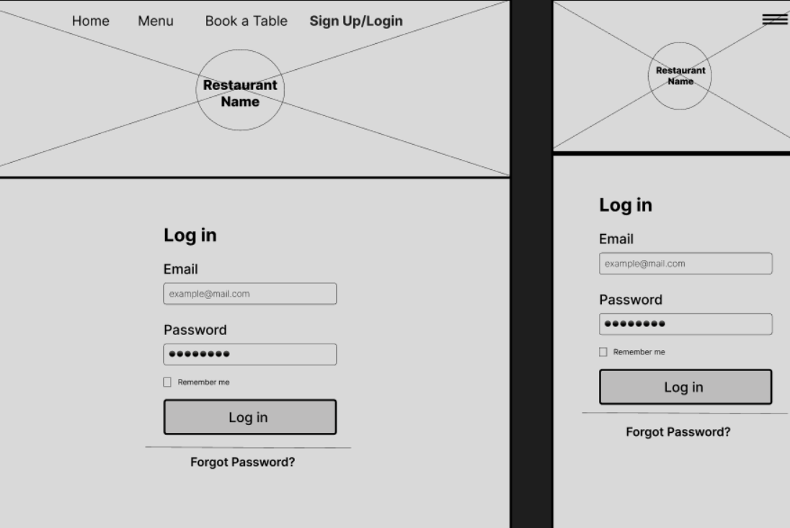

Delhi Darbar :

* Delhi Darbar is a Asian Resturant and vegan Cafe based in Dublin that welcomes all people and serves delicious brunch items to customers. The goal is to create a nurturing space where people can connect, explore sustainable living, and indulge in mouthwatering dishes. The website includes a Menu, Reservation options and account creations for the individual user.

* Delhi Darbar |Asian cuisine & Cafe 🌱:

* Delhi Darbar is a Asian Resturant and vegan cafe that goes beyond serving delicious plant-based food!
 
* We are committed to creating a nurturing space where people can connect, explore sustainable living, and indulge in mouthwatering dishes. Our menu features a diverse range of flavorful, cruelty-free options that cater to all dietary preferences. We source locally and prioritize eco-friendly practices to minimize our environmental footprint. At Happy Leeks, we believe in the power of food to create positive change in the world. Join us as we redefine vegan cuisine and spread happiness one leek at a time!

Opening Time :

Get in Touch!

Opening Hours 

Monday

Tuesday

Wednesday

Thursday

Friday

Saturday

Sunday

08:00 - 23:00

08:00 - 23:00

08:00 - 23:00

08:00 - 23:00

08:00 - 23:00

08:00 - 23:00

08:00 - 23:00

* On Bank Holiday we open 10:00 to 23:00

Find Us 
786 Greenwood Avenue

St. peter street Limrick Mall

County Limrick

IRELAND

Contact Us

 +353 85 666 333

 + 061 234 123

 test@fatima.com

 User Experience :

 * Delhi Darbar should invite peole to visit the Asian food and cafe. The reservation system makes it possibe for the customer to book a table in advance.

 User Stories :

 User :
* As a site user I can visit the restaurant's landing page so that I can find information about the restaurant.

* As a site user I can view the menu so that I know what food the restaurant has to offer.

* As a site user I can register an account so that I can book a table for one or more guests at a particular time and date.

* As a logged in user I can make a reservation so that I can book a table/multiple tables for one or more guests at a specific date and 
  time, view and update my existing reservation/s or delete any existing reservation.

* As a logged-in user I can see my login status so that I know that I am logged in.

* As a site user I can find links to their social media so that I can follow the restaurant on social media.

* As a site user I can view essential information so that I can find out about the address, business hours, phone number and other important information.
* As a site user I can view photos so that I get a feel of the atmosphere and what style of food is served in the restaurant.

Admin

* As an admin I can manage items on the menu so that I can create, view, update and delete any items.

* As an admin I can manage the reservation so that I can create, view, update and delete any reservation and avoid any double reservations.

Design

* Imagery :

Imagery is used regarding restaurant environment and food content on the website. They are taken from various websites, which are credited down below in the Credits section.

* Colour Scheme :

* This website uses a palette of lighter gray and blue tones, as well as light and dark green and light pink tones. It also uses some variants of the same colour scheme belonging to their colour family. It was created by using Coolors. 

* cooler.png

$ F28482  84A59D  F6BD60  DC9E82  DC9E82  93C0A4 0E6164  FFCFC2

 
 

  Wireframes :

Typography :

$ I have imported the following Google Fonts:

$ Playfair Display 400, 500 for headings on the website.

$ Open Sans 300, 400, 600 for the body text on the website.

Local Development :

* How to Fork

1 Navigate to project repository.

2 Click on "Fork" in the top right corner.

3 Under "Owner," select the dropdown menu and click on owner for the forked repository.

4 To change the name of repo, enter a new name.

5 Enter description(optional).

6 Choose which branches to include.

7 Click "Create Fork".

How to Clone

1 Navigate to project repository.

2 Click on the button Code next to the Gitpod button.

3 Choose between HTTPS, SSH and GitHub CLI and copy the link.

4 Open Git Bash.

5 Change the current working directory to the location where you want the cloned directory.

* Credits:

Code Used

$ Django Documentation

$ Bootstrap 5.3

$ W3Schools

$ Stackoverflow

$ Hello Django Walkthorugh Project

$ I think therefore I blog Walkthorugh Project.

$ Django Allauth - used as reference when creating account authorisation.

$ Maharaja Resturant - used for general reference, ideas and logic throughout the project.

$ Youtube - used as a reference when creating the menu.

$ Django Tutorial - used as reference for creating set times on the reservation form.

$ sina's Repository - used as reference for update and delete modal

$ Kera Cudmore's sample readme - used when creating README.md and TESTING.md

* Home Page :

$ The Homepage is the landing page of the website, where a user lands first when opening the url. It contains the navbar at the top and footer at the bottom. Between the user can find a small about section with an image of the interior of the restaurant, a gallery section to view some of the dishes, the decoration and atmosphere of the restaurant. Below is the essential information section, where the user can find the location, opening times and contact details.

* Deployment :

$ Logout Page :

$ The Logout Booking page can be reached via the dropdown menu once the user has logged in. 

It contains the navbar at the top and footer at the bottom. The user is asked to confirm if they want to sign out. If user proceeds, they will be directed to the landing page.

 A message will pop up to let them know that they have logged out successfully. Logout Page

* A responsive footer :

$ The footer contains the social media icons of Facebook, Instagram, Twitter, and Pinterest, which open all in a new tab when clicked on.

$ It also contains the copyright with the current year.

* Future Considerations

$ Future features that could be implemented on the website could include being able to add reviews and view reviews of other customers. Another implementation could be an online ordering system.

* Accessibility

$ For better accessibility I added alt-labels to all my images for vision-impaired users. Accessibilty was also tested on lighthouse, which reached a very high score on every testing.

* Technologies Used

$ Languages Used

$ HTML

$ Python

$ CSS

$ JavaScript

$ Frameworks, Libraries & Programs Used

$ Django - Main python framework used for this project.

$ ElephantSQL - Stores database for this project.

$ Heroku - Cloud-based platform used to deploy this project.

$ Bootstrap 5.3 - CSS styling used for decorating HTML content.

$ Github - Used for version control and agile development progress.

$ Gitpod - Used as cloud-development platform.

$ Google Fonts - Used for imported fonts for this project.

$ Am I responsive - Used to check if website is fully responsive.

$ PEP8 - Used to validate python code.

$ W3C - Used to validate HTML and CSS.

$ Favicon - Used to create Favicon for this project.

$ Cloudinary - Used to store website images of this project on a cloud-platform.

$ Figma - Used to design wireframes.

$ Font Awesome - Used for icons.

$ Coolors - Used to create colour palette.

$ Tiny JPG - Used to convert images.

$ Cloud Convert - Used to convert images.

* Deployment & Local Development

$ This project was created by using Gitpod. I used the pre-built template from Code Institute. The following commands were used:

$ git add . - to add all the changes.

$ git commit -m "..." - to commit all the changes to the local repository.

$ git push - to push the committed changes to the GitHub repository.

* Deployment

In the Terminal:
$ Install Django and gunicorn.(pip3 install 'django<4' gunicorn)

$ Install supporting libraries.(pip3 install dj_database_url==0.5.0 psycopg2)

$ Install Cloudinary Libraries. (pip3 install dj3-cloudinary-storage)

$ Create requirements file.(pip3 freeze --local > requirements.txt)

$ Create Project.(django-admin startproject PROJ_NAME .)

$ Create App.(python3 manage.py startapp APP_NAME)

* In settings.py:
$ Add to installed apps.('APP_NAME')

$ In the Terminal

$ Migrate Changes.(python3 manage.py migrate)

$ Run Server to Test.(python3 manage.py runserver)

* On elephantsql.com:

$ Log in to your ElephantSQL account.

$ Click “Create New Instance”.

$ Set up your plan.

$ Click “Select Region”.

$ Click “Review”.

$ Return to the ElephantSQL dashboard and click on the database instance name for this project.

$ Copy your ElephantSQL database URL using the Copy icon. It will start with postgres:// .

* On heroku.com :

$ Create new Heroku App.

$ Open the settings tab.

$ Click Reveal Config Vars.

$ Add a Config Var called DATABASE_URL and add ElephantSQL database url.

* In the terminal:

$ Create new env.py file on top level directory.

$ In env.py:

$ Import os library.

$ Set environment variables.

$ Add in secret key.

$ On heroku.com:

$ Add Secret Key to Config Vars, (SECRET_KEY)

* In settings.py:

$ Reference env.py.

$ Remove the insecure secret key and replace.(os.environ.get('SECRET_KEY'))

$ Comment out the old DataBases Section.

$ Add new DATABASES Section. (dj_database_url.parse(os.environ.get("DATABASE_URL")))

* In the terminal:

$ Save all files and Make Migrations.

$ On cloudinary.com :

$ Copy your CLOUDINARY_URL from Clouinary Dashboard.

$ In env.py:

$ Add Cloudinary URL to env.py.

* On heroku.com:

$ Add Cloudinary URL to Heroku Config Vars.(CLOUDINARY_URL)

$ Add DISABLE_COLLECTSTATIC to Heroku Config Vars. (value = 1)

* In settings.py :

$ Add Cloudinary Libraries to installed apps. ('cloudinary_storage', 'cloudinary',)

$ Tell Django to use Cloudinary to store media and static files.

$ Link file to the templates directory in Heroku.(TEMPLATES_DIR = os.path.join(BASE_DIR, 'templates'))

$ Change the templates directory to TEMPLATES_DIR.

$ Add Heroku Hostname to ALLOWED_HOSTS. ("PROJ_NAME.herokuapp.com", "localhost")

* In the terminal:

$ Create a Procfile on the top level directory.

$ In Procfile:

$ Add web: gunicorn PROJ_NAME.wsgi.

* Final deployment:

$ Set DEBUG = False in the settings.py

$ On Heroku select "GitHub" as Deploment Method and connect to your GitHub and the repository you want to upload.

$ Choose between automatic/manual deploy option.

$ After app was successfully deployed, click the "View" button to view the deployed live site.

* Local Development

$ How to Fork

$ Navigate to project repository.

$ Click on "Fork" in the top right corner.

$ Under "Owner," select the dropdown menu and click on owner for the forked repository.

$ To change the name of repo, enter a new name.

$ Enter description(optional).

$ Choose which branches to include.

$ Click "Create Fork".

* How to Clone

$ Navigate to project repository.

$ Click on the button Code next to the Gitpod button.

$ Choose between HTTPS, SSH and GitHub CLI and copy the link.

$ Open Git Bash.

$ Change the current working directory to the location where you want the cloned directory.

$ Testing

$ Please find the carried out testing on TESTING.md.

* Credits

$ Code Used

$ Django Documentation

$ Bootstrap 5.3

$ W3Schools

$ Stackoverflow

$ Hello Django Walkthorugh Project

$ I think therefore I blog Walkthorugh Project

$ Django Allauth - used as reference when creating account authorisation.

$ Maharaja Resturant - used for general reference, ideas and logic throughout the project.

$ Youtube - used as a reference when creating the menu.

$ Django Tutorial - used as reference for creating set times on the booking form.

$ sina's Repository - used as reference for update and delete modal

$ Kera Cudmore's sample readme - used when creating README.md and TESTING.md

* Content

The Menu content was created from delhi darbar website and my own creations.

* Media

$ The images were downloaded from Pexels and Unsplash.

* Acknowledgements

$ I would like to express my sincere gratitude to tutor, for his invaluable guidance, unwavering support, and endless patience throughout the entire project.

$ Additionally, I would like to extend a special thanks to the Tutoring Team at Code Institute, who provided continuous assistance whenever I encountered challenges, as well as the exceptional Slack Community, whose members were always ready to lend a helping hand.

$ I am truly grateful to all of you for your invaluable guidance and support throughout this project!

* Acknowledgments :

$ Code Institute For the Code Institute course material in html and CSS and Python for the Slack community members for their support and help. My Code Institue tutor who inspired me to push myself further.